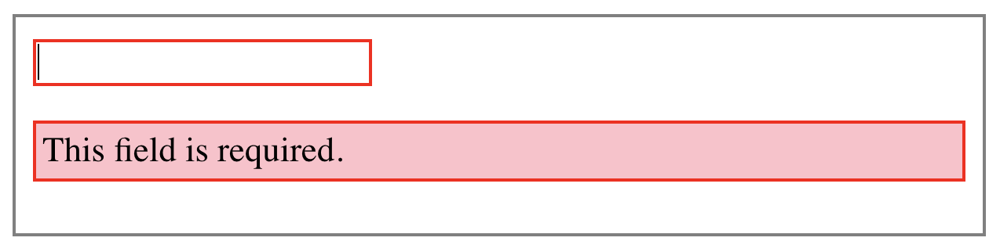

# Directives

## Using Structural Directives

### Rendering a List of Items

Some data has been received which looks like this:

        [
          {
              "id": 4,
              "first_name": "Eve",
              "last_name": "Holt",
              "avatar": "https://s3.amazonaws.com/uifaces/faces/twitter/marcoramires/128.jpg"
          },
          {
              "id": 5,
              "first_name": "Charles",
              "last_name": "Morris",
              "avatar": "https://s3.amazonaws.com/uifaces/faces/twitter/stephenmoon/128.jpg"
          },
          {
              "id": 6,
              "first_name": "Tracey",
              "last_name": "Ramos",
              "avatar": "https://s3.amazonaws.com/uifaces/faces/twitter/bigmancho/128.jpg"
          }
        ]

Write a component that displays each contact using `*ngFor`.

> To import the JSON file, use:
>
>     import contactListData from './contact-list.json';

### Conditional Rendering

1. In the previous exercise you created two components: an input box with a coloured border, and a warning component. Have the input box display the warning component only if the field is empty:

   

   > It's best to make the warning component a _child_ of your coloured input component at this stage.

2. How would you render a separate piece of content (or component) if the input field is valid? Implement it.
