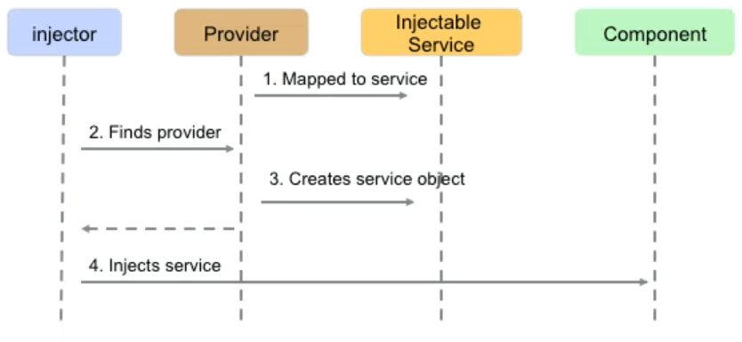
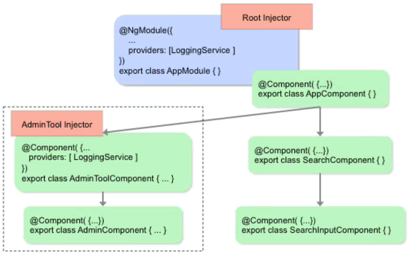
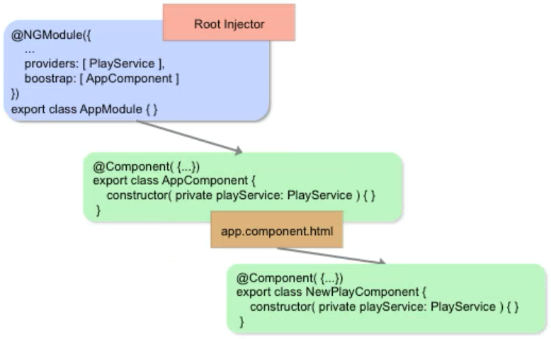

# Purpose of Dependency Injection (DI)

DI:

- provides dependencies to the objects that need them ("wiring")
- reduces the amount of information a component needs to know about its dependencies
    - this simplifies understanding, development and testing

---

# Dependency Injection (DI)

- Injector
    - finds a provider that can supply a service instance
    - provides a reference to that service instance to component
- Provider
    - All components sharing a provider share the same service
    - This service is a singleton per provider


---

# Service

A Service:

- provides functionality and/or data to components
- is an `@Injectable` TypeScript class
- often acts as a bridge between UI and server
- can enable components to share functionality and data

Services and Modules

A service can be:

- used within a module
- exported out of a module
- scoped to components (and children of such components)

---

# Injectors, Services and Providers

Injecting a service on demand by a component:



---

# Decorators for DI - 1

`@Injectable`

```typescript
import { Injectable } from '@angular/core';
...
@Injectable()
export class PlayService { }
```

- Any decorated class can be injected

---

# Decorators for DI - 2


`@Inject()`

- A manual mechanism for injecting a constructor parameter
- Constructor injection is the only mechanism Angular supports
- Typically not needed for object types

```typescript
import { Inject } from '@angular/core'
export class AppService {
    ...
    constructor(@Inject(PlayService) service: PlayService) { ... }
}
```

---

# Defining a Service

A service is simply an injectable TypeScript class:

```typescript
import { Injectable } from '@angular/core';
import { Play } from './play';

@Injectable()
export class PlayService {
  private PLAYS: Play[] = [
      { id: 1, title: 'Hamlet' },
      { id: 2, title: 'The Tempest' },
      { id: 3, title: 'Othello' },
      { id: 4, title: 'Macbeth' },
      { id: 5, title: 'Henry III' },
  ];

  getPlays(): Play[] {
      return this.PLAYS;
  }
}
```

---

# Informing a Component about a Provider

- Injectors work with Providers
    - Providers supply injector for the injector to inject
    - Providers map a type (or token) to an implementation

- Provider specified via `@Component` decorator's `providers:` property

```typescript
@Component({
    selector: 'app-root',
    templateUrl: './app.component.html',
    styleUrls: [ './app.component.css' ],
    providers: [ PlayService ]
})
export class AppComponent {
    constructor( private playService: PlayService) { ... }
}
```

---

# Registering a Provider with a Module

- Registering with a module enables provider to be used module-wide

```typescript
import { NgModule } from '@angular/core';
import { BrowserModule } from '@angular/platform-browser';
import { AppComponent } from './app.component';
import { PlayService } from './services/play.service';

...

@NgModule({
  declarations: [
    AppComponent,
    ...
  ],
  imports: [ BrowserModule ],
  providers: [ PlayService ],       // <- register with module here
  bootstrap: [AppComponent]
})
export class AppModule { }
```


---

# A Hierarchy of Injectors

An Angular app may have multiple injectors:




---

# Where to Declare a Provider?

On Module? (`@NgModule.providers`)

- In general, declare feature-specific providers on modules
    - rather than on components/directives

On Component? (`@Component.providers`)

- When you want to limit scope to that component or component tree

On Root Module?

- When you want to make the service available application-wide

---

# Sharing Services across Components




---

# Injecting other Types

The DI framework in Angular is flexible

- Token doesn't need to match type:

        providers: [{ provide: DataService, useClass: DataService }],
        providers: [{ provide: DataService, useClass: MockDataService }],

- Using a Factory Function instead of a Class:

        const randomFactory = { () => Math.random() };
        ...
        providers: [{ provide: 'Random', useFactory: randomFactory }],

- Using a Value:

        providers: [{ provide: 'Random', useClass: Math.random() }],

- Injecting a Primitive Type

        constructor(@Inject('Random') r) { ... }
